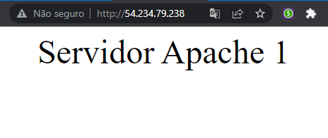
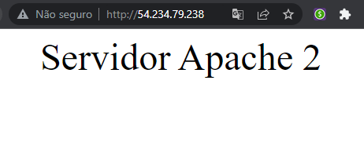
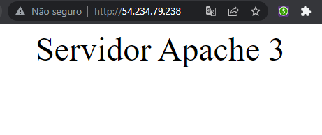

<h1 align="center">
    <a>☁️ Desafio 2 Terraform</a>
</h1>

## Requisitos

- [x] Criar uma VPC, não pode ser a default da conta;
- [x] Criar 3 subnets públicas, uma em cada AZ dentro da nova VPC;
- [x] Criar 3 subnets privadas, uma em cada AZ dentro da nova VPC;
- [x] Criar 1 Internet Gateway;
- [x] Criar 1 Nat Gateway;
- [x] Criar 2 Security Groups;
- [x] Criar 3 Instâncias EC2 utilizando a AMI da amazon Linux, instalar o apache liberar o acesso conforme abaixo:
- Alterar o arquivo /var/www/html/index.html adicionando o texto "Servidor Apache 1", e subir o serviço na porta 3001
- Alterar o arquivo /var/www/html/index.html adicionando o texto "Servidor Apache 2", e subir o serviço na porta 3002
- Alterar o arquivo /var/www/html/index.html adicionando o texto "Servidor Apache 3", e subir o serviço na porta 3003

Obs: As 3 instâncias devem ser deployadas uma em cada subnet privada com acesso a internet somente para instalação de pacotes, o apache não deve mostrar sua versão aos clientes atráves do nmap ou inspect via browser, desabilitar a versão 1.0 http e configurar no SO o tcp reuse e tcp port recycle (Que serve para reutilizar as portas TCP do kernel)
- [x] Criar 1 Instância com nginx em uma subrede publica que será utilizada como LoadBalancer conforme abaixo: Esta instância deve ter acesso full a internet e acesso as portas de serviço das EC2 com apache via Security Group. Configurar o LoadBalancer no modo Random e acessivel via porta 8080, durante a apresentação o acesso deve ser feito no ip publico desta EC2 para validar o funcionamento do balancer;
- [x] Criar 1 Bucket S3 sem acesso a internet para servir de repositório para o terraform.tfstate.

## Obrigatório

- AS EC2 devem ser deployadas utilizando "count" através do módulo criado no ultimo desafio;
- As subnets devem ser criadas utilizando "count" ou "for_each";
- Necessario ter output dos ips privados das 3 EC2 com apache e do ip publico da EC2 com nginx;
- Utilizar dynamic block para provisionamento de um item de sua escolha da infraestrutura.

## Infraestrutura

#### Primeira Etapa: Criação do bucket 

Para realizar a proposta de automação foi desenvolvido primeiramente o sistema com um bucket S3 para servir de repositório para o terraform.tfstate.

O Terraform armazena o estado de sua infraestrutura e configurações gerenciadas. Esse estado é usado pelo Terraform para mapear recursos do mundo real para sua configuração, acompanhar metadados e melhorar o desempenho de grandes infraestruturas.

Esse estado é armazenado por padrão em um arquivo local chamado **terraform.tfstate**, mas também pode ser armazenado remotamente, o que funciona melhor em um ambiente de equipe.

Os códigos abaixo demonstram a criação de um bucket que irá realizar o armazenamento remoto do arquivo terraform.tfstate.

<details><summary>Bucket S3</summary>

Primeiramente é necessário criar o bucket que irá armazenar o arquivo no **bucket/main.tf**.

```js
resource "aws_s3_bucket" "kt-terraform" {
  bucket = "desafio-terraform-luis" 

  
  versioning {
    enabled = true
  }
  
  tags = {
    Description = "Armazenamento do arquivo do terraform.tfstate"
    ManagedBy   = "Terraform"
    Owner       = "Luis Campos"
    CreatedAt   = "2022-02-05"
  }
}

```
No arquivo **infra/main.tf** é criado o backend que irá popular o bucket S3.

```js
terraform {

  required_providers {
    aws = {
      source  = "hashicorp/aws"
      version = "3.23.0"
    }
  }
  
  backend "s3" {
    bucket  = "desafio-terraform-luis"
    key     = "kt/terraform.tfstate"
    region  = "us-east-1"
    profile = "desafio2"
  }
}
```
</details>

<p></p>

Entre na pasta **bucket** e execute os comandos **terraform init**, **terraform plan** e **terraform apply** para criar o bucket S3 que servirá de repositório para o arquivo de estado do terraform. Após o bucket ter sido criado entre na pasta **infra** e realize os mesmos comandos para subir toda a infraestrutura para a AWS.
Acessando o serviço S3 na AWS é possível verificar a criação do bucket, conforme imagem abaixo:

<p></p>

<p align="center">
  
</p>

#### Segunda Etapa: Criação do restante da infraestrura 

Primeiramente foram desenvolvidos recursos essenciais de VPC, Internet Gateway, Subnets Públicas e Privadas, Route Tables e um Nat gateway no arquivo **infra/vpc.tf**:
<details><summary>VPC</summary>

```js

# Criação da VPC
resource "aws_vpc" "vpc" {
  cidr_block = "192.168.0.0/16"
  tags       = merge(local.common_tags, { Name = "Terraform VPC" })
}

```
<p></p>
</details>

<details><summary>Internet Gateway</summary>

```js

# Criação do Internet Gateway
resource "aws_internet_gateway" "igtw" {
  vpc_id = aws_vpc.vpc.id
  tags   = merge(local.common_tags, { Name = "Terraform IGW" })
}

```
<p></p>
</details>

<details><summary>Subnets Publicas e Privadas</summary>

```js

# Criação das subnets públicas
resource "aws_subnet" "pub_subnet" {
  count                   = length(var.public_subnet_ip)
  vpc_id                  = aws_vpc.vpc.id
  availability_zone       = var.azs[count.index]
  cidr_block              = var.public_subnet_ip[count.index]
  map_public_ip_on_launch = true
  tags                    = merge(local.common_tags, { Name = "Public Subnet ${count.index + 1}" })
}

# Criação das subnets privadas
resource "aws_subnet" "pvt_subnet" {
  count             = length(var.private_subnet_ip)
  vpc_id            = aws_vpc.vpc.id
  availability_zone = var.azs[count.index]
  cidr_block        = var.private_subnet_ip[count.index]
  tags              = merge(local.common_tags, { Name = "Private Subnet ${count.index + 1}" })
}
```
<p></p>
</details>

<details><summary>Route Tables Publicos e Privados</summary>

```js

# Criação da Route Table Public
resource "aws_route_table" "public" {
  vpc_id = aws_vpc.vpc.id

  route {
    cidr_block = "0.0.0.0/0"
    gateway_id = aws_internet_gateway.igtw.id
  }

  tags = merge(local.common_tags, { Name = "Route Table Public" })
}

# Criação da Route Table Private
resource "aws_route_table" "private" {
  vpc_id = aws_vpc.vpc.id

  route {
    cidr_block = "0.0.0.0/0"
    gateway_id = aws_nat_gateway.nat.id
  }

  tags = merge(local.common_tags, { Name = "Route Table Private" })
}
```
<p></p>
</details>

<details><summary>Associações das subnets com as Route Tables</summary>

```js

# Criação da associação das Subnets na Route Table Publica
resource "aws_route_table_association" "pub_association" {
  count          = length(var.public_subnet_ip)
  subnet_id      = aws_subnet.pub_subnet[count.index].id
  route_table_id = aws_route_table.public.id
}

# Criação da associação das Subnets na Route Table Privada
resource "aws_route_table_association" "pvt_association" {
  count          = length(var.private_subnet_ip)
  subnet_id      = aws_subnet.pvt_subnet[count.index].id
  route_table_id = aws_route_table.private.id
}

```
<p></p>
</details>

<details><summary>Nat Gateway</summary>

```js

resource "aws_eip" "this" {
  vpc = true
}

# Criação do Nat Gateway
resource "aws_nat_gateway" "nat" {
  allocation_id = aws_eip.this.id
  subnet_id     = aws_subnet.pub_subnet[1].id

  tags = {
    Name = "gw NAT"
  }

  # To ensure proper ordering, it is recommended to add an explicit dependency
  # on the Internet Gateway for the VPC.
  depends_on = [aws_internet_gateway.igtw]
}

```
<p></p>
</details>

<p></p>

A infraestrura das instâncias foram criadas no arquivo **infra/ec2.tf**, onde foram criadas as intâncias contendo o apache e o nginx:

<details><summary>Key Pair</summary>

```js

# Criação da key pair
resource "aws_key_pair" "my_key" {
  key_name   = "aws_key"
  public_key = file(pathexpand("~/.ssh/id_rsa.pub"))
}

```
<p></p>
</details>

<details><summary>EC2 com Apache</summary>

```js

# Criação das EC2 com Apache instalado
module "aws_instance_ec2_apache" {
  source = "./module_apache"

  count                  = length(var.private_subnet_ip)
  ami                    = var.ami
  instance_type          = var.instance_type
  key_name               = aws_key_pair.my_key.key_name
  vpc_security_group_ids = [aws_security_group.ec2_rules_apache.id]
  subnet_id              = aws_subnet.pvt_subnet[count.index].id
  private_ip             = var.private_ip[count.index]
  user_data              = file(var.server_apache[count.index])

  tags = merge(local.common_tags, { Name = "Instance Apache ${count.index + 1}" })
}

```
<p></p>
</details>

<details><summary>EC2 com Nginx</summary>

```js

# Criação das EC2 com Nginx instalado
module "aws_instance_ec2_nginx" {
  source = "./module_nginx"

  ami                    = var.ami
  instance_type          = var.instance_type
  key_name               = aws_key_pair.my_key.key_name
  vpc_security_group_ids = [aws_security_group.ec2_rules_nginx.id]
  subnet_id              = aws_subnet.pub_subnet[0].id
  user_data              = file("./scripts/nginx.sh")

  tags = merge(local.common_tags, { Name = "Instance Nginx" })
}

```
<p></p>
</details>

<p></p>

Todos os recursos foram criados utilizando variáveis no arquivo **infra/variables.tf**, e passados como parâmetros nos seus respectivos recursos ou módulos.

<p></p>

Foi criado um diretório contendo todos os scripts necessários para a instalação e configurações do Apache e Nginx, é possível acessar os scripts em **infra/scripts**:

<p></p>

<details><summary>Script Nginx</summary>

```js

#!/bin/bash
sudo su
sudo yum update -y
sudo amazon-linux-extras install nginx1.12 -y
sudo systemctl start nginx

ssh-keygen -t rsa -f /home/oracle/.ssh/id_rsa -q -P ""
echo "" > /home/ec2-user/.ssh/id_rsa

chmod 400 /home/ec2-user/.ssh/id_rsa
chown ec2-user:ec2-user /home/ec2-user/.ssh/id_rsa

echo "events{}
http {
   upstream backend {
      server 192.168.4.10:3001; 
      server 192.168.5.11:3002;
      server 192.168.6.12:3003;
   }

   server {
      listen 8080;
      listen 80;
      location / {
         proxy_pass http://backend;
      }
   }
}" > /etc/nginx/nginx.conf

sudo systemctl restart nginx

sudo yum install nmap -y

```
<p></p>
</details>

<details><summary>Script Apache 1, 2 e 3</summary>

```js

#!/bin/bash
sudo su
sudo yum update httpd
sudo yum install httpd -y
sudo systemctl start httpd

echo '<center><font size="10">Servidor Apache 1</font></center>' > /var/www/html/index.html
echo "ServerTokens Prod" >> /etc/httpd/conf/httpd.conf
echo "ServerSignature Off" >> /etc/httpd/conf/httpd.conf

sed -i 's/80/3001/g' /etc/httpd/conf/httpd.conf

echo "# Decrease TIME_WAIT seconds
net.ipv4.tcp_fin_timeout = 30
# Recycle and Reuse TIME_WAIT sockets faster
net.ipv4.tcp_tw_recycle = 1
net.ipv4.tcp_tw_reuse = 1" >> /etc/sysctl.conf

sudo systemctl restart sshd
systemctl restart httpd

sudo yum install nmap -y

```
<p></p>
</details>

<p></p>

Após ter executado o comando **terraform apply** no diretório **infra**, sua infraestrutra estará completa na AWS, para testar o funcionamento é necessário acessar a instância Nginx pelo seu IP Público disponibilizado pelo output ou diretamente no console da AWS. A cada refresh na página o nginx redirecionará o tráfego para uma instância Apache diferente de forma random, conforme imagens abaixo:

<p align="center">
  
</p>

<p align="center">
  
</p>

<p align="center">
  
</p>

